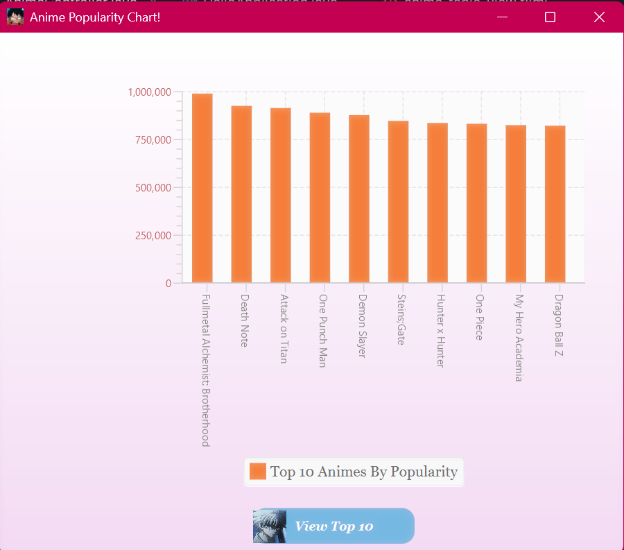
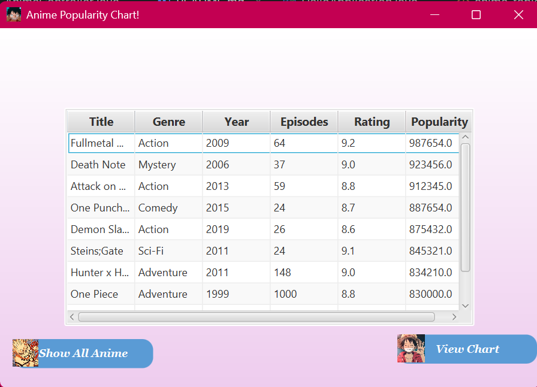

<h1>Anime Popularity & Ratings</h1>

This JavaFX application allows the users to view and compare the metrics for anime series at a glance.
It allows the user to determine what series is a good boredom escape.

- The Bar Chart shows the anime by popularity
- The Table View shows all the series etc. title, genre, episodes etc
- The switch scene alternates between the Chart and Table connecting to the Database, which allows users different views

  
  

